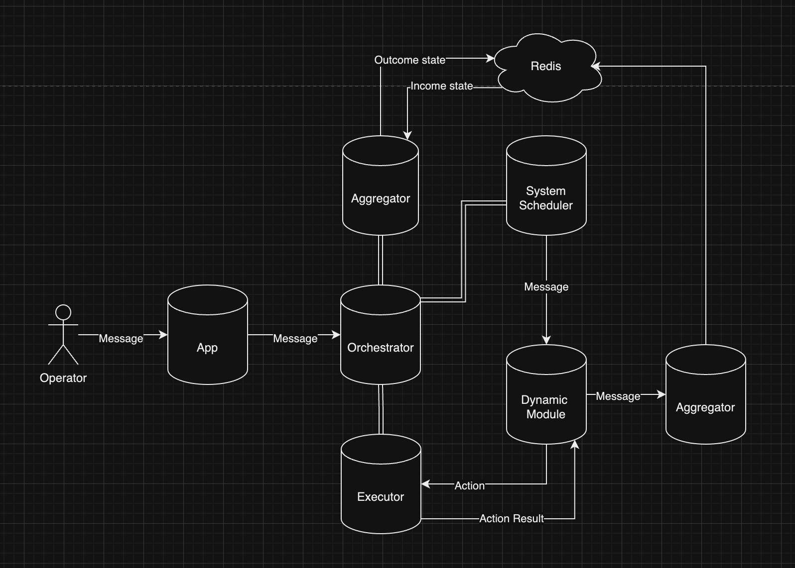

# Basic Flow Description:

1. **Operator (user)** should put a message with data payload and module name to the **App**, using REST.
2. **App** receives the message and transfers it to the **Orchestrator** library. 
3. **Orchestrator** setting up connections (Rabbit, Redis, etc). 
4. **Orchestrator** setting up **System Scheduler** class.
5. **System Scheduler** puts message to REDUX state and calls **Orchestrator Aggregator** to put
REDUX state to **Redis**.
6. By the “moduleName'' key in message **System Scheduler** inits correct **Dynamic Module**.
7. **Dynamic Module** on init calls **Dynamic Module Aggregator** and checks if there are any unprocessed messages
   in **Redis**.
   1. If there are no unprocessed messages from the last session, **Dynamic Module** will put a new message to Redis
      through **Aggregator**.
      Then puts a message to Redux and calls correct action.
   2. If there are unprocessed messages, check order and start with correct one.
9. Action calls **Executor**. **Executor** performs the correct service call and
returns the result to the actions chain in **Dynamic Module**.
10. **Dynamic Module** changes its state in dependency of fail/success action, calls **Dynamic Module Aggregator** and
    **Orchestrator Aggregator** to change state in Redis.

### Links:
[Diagram](https://drive.google.com/file/d/1PIX0XLaudvb6ar3xuXY6jUQHB4Ktnave/view?usp=sharing/ "Named link title")
